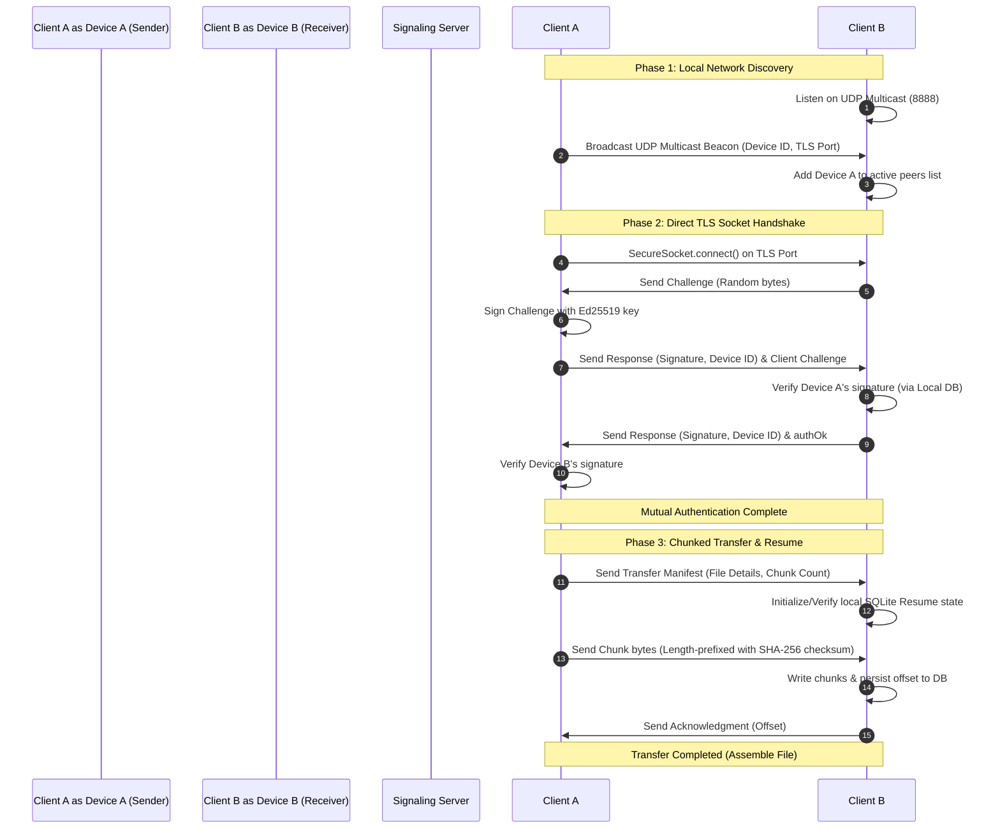

# Flashy 🚀

Flashy is a premium, secure, high-speed cross-platform peer-to-peer (P2P) file transfer application built with Flutter and Node.js. It automatically detects nearby local network (LAN) peers for direct TLS socket transfers, falling back to signaling coordination when necessary.

---

## 🌟 Core Features

- **⚡ Fast LAN Direct Transfer**: Bypasses the internet and transfers files over local Wi-Fi at maximum hardware speeds using direct secure TLS socket streams.
- **📡 UDP Multicast Discovery**: Pure-Dart UDP multicast beaconing (`224.0.2.51`) that discovers active local peers on the fly without complex mDNS configuration.
- **🔒 Mutual cryptographic Handshakes**: End-to-end encryption using self-signed TLS sockets, secured via a challenge-response verification of local Ed25519 contact keys.
- **📧 Multi-Device Email Link**: Link multiple devices under a single email account to sync trust keys across all your desktops and mobiles automatically.
- **🔄 Resumable Transfers**: Chunk-based file streaming (512KB chunks) with SHA-256 integrity verification and SQLite progress persistence—interrupted transfers automatically pick up where they left off.
- **📱 Hybrid Pairing UI**: QR code display and scanning to pair devices, wrapped in a premium dark-mode Material UI dashboard.

---

## 📐 System Architecture

The following diagram illustrates how Flashy coordinates peer discovery, establishes direct secure sockets, and executes files transfers over the LAN:



---

## 📁 Repository Structure

- **`/app`**: Flutter client application targeting Android, iOS, macOS, Windows, and Linux.
- **`/signaling-server`**: Node.js WebSocket signaling server for session linking, mail routing, and registration.
- **`/turn-server`**: coturn configuration setup for TURN relays.
- **`/docs`**: In-depth System Architecture and Security specifications.

---

## 🚀 Getting Started

### 1. Launch the Signaling Server
Navigate to the signaling server directory, install dependencies, and run:
```bash
cd signaling-server
npm install
npm start
```
*Note: Make sure your signaling server port `3000` is open. Update the IP in the Flutter app Settings if running on a physical phone.*

### 2. Run the Flutter Client
Navigate to the app directory, fetch packages, and launch:
```bash
cd app
flutter pub get
flutter run
```

### 3. Run the Automated Tests
Ensure that your development environment is fully verified by running the 36 backend integration and unit tests:
```bash
cd app
flutter test
```

---

## 🛡️ Security & Privacy Design

1. **Zero-Trust LAN Transfer**: Direct socket links do not trust the local router. All communication is wrapped in a private TLS connection. Host verification is pinned to local Ed25519 identity key signatures to completely eliminate Man-in-the-Middle (MITM) risks.
2. **Local Integrity Verification**: Every chunk is signed with a SHA-256 checksum. The receiver validates the hash of every chunk against the file manifest to guarantee no corrupted payloads are written to disk.
3. **App Private Database**: Pairing keys, contact names, and transfer chunk tracking are stored entirely inside private application directory databases (iOS Sandbox / Android Protected Storage), invisible to other user-level applications.
